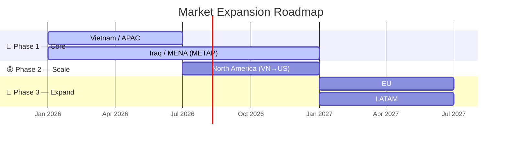
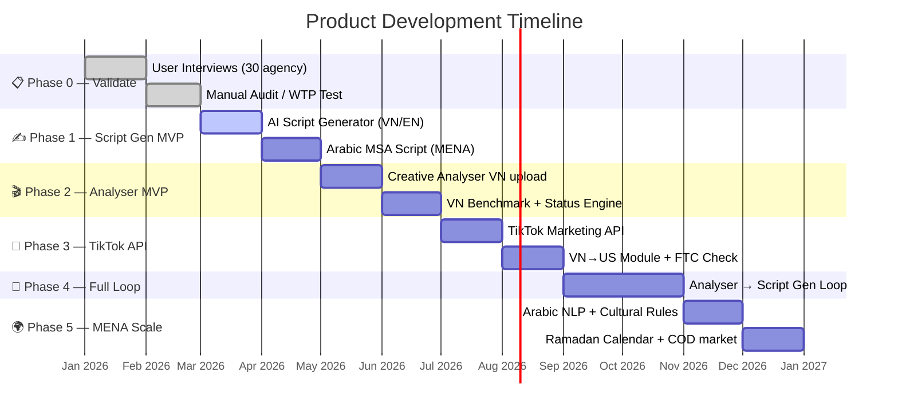
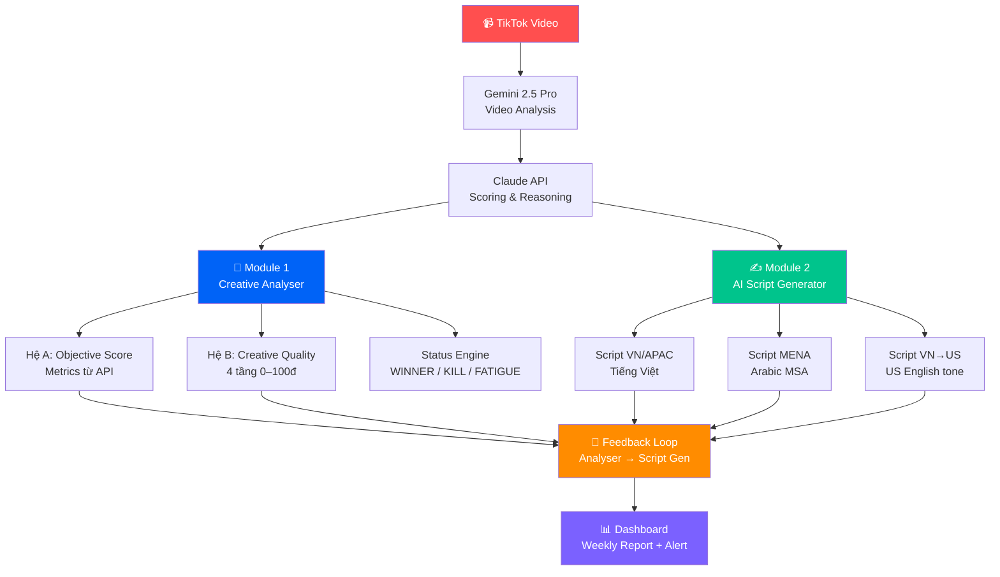
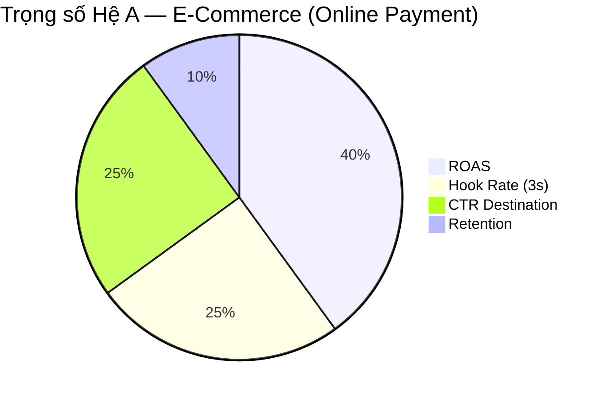
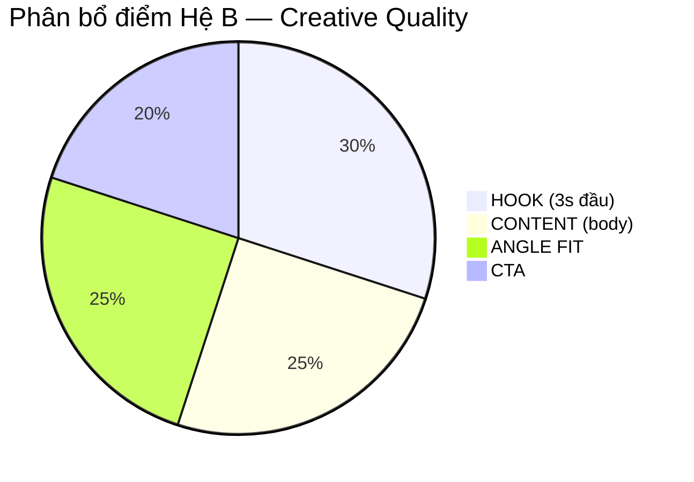
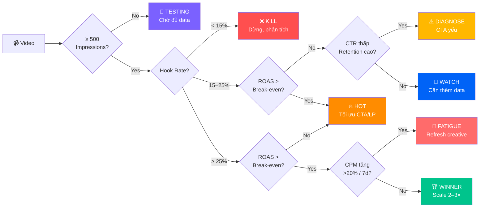
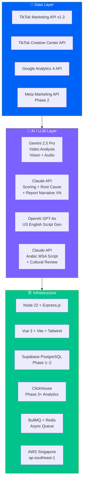
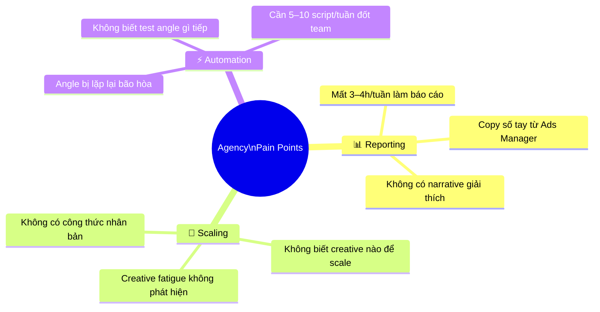
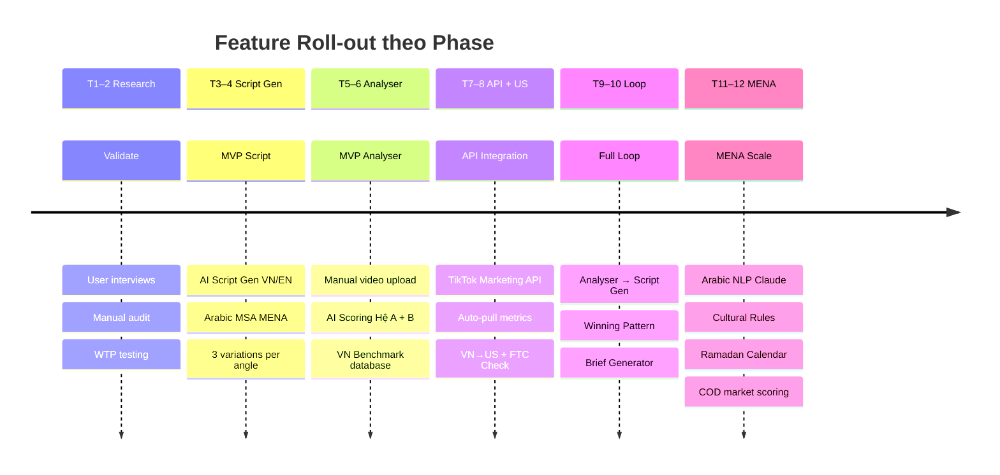

# 🏆 Product Roadmap — Creative Scoring Platform (TikTok Ads Agency)

> **Mục tiêu sản phẩm**: Không chỉ tìm ra video thắng — mà tìm ra **công thức nhân bản video thắng**.
> **Khách hàng mục tiêu**: Agency quản lý TikTok Ads — Pain points: Report, Scale, Automation.

---

## 📌 Executive Summary

| Hạng mục | Chi tiết |
|---|---|
| **Sản phẩm** | Creative Scoring & AI Script Generation Platform cho TikTok Ads Agency |
| **Thị trường Phase 1** | 🇻🇳 Vietnam / APAC + 🇮🇶 Iraq / MENA |
| **Timeline** | 12 tháng (Tháng 1 → Tháng 12) |
| **Revenue model** | SaaS subscription — agency pay monthly |
| **Tech stack** | Gemini 2.5 Pro + Claude AI + TikTok API + Supabase |
| **Competitive edge** | Phân tích từng element của video, không chỉ chấm điểm tổng; kèm gợi ý hành động cụ thể |

---

## 🌍 Thị Trường Mục Tiêu

| Khu vực | Tên đầy đủ | Mức độ ưu tiên | Trạng thái |
|:---:|---|:---:|:---:|
| **APAC** | Asia-Pacific (VN, TH, ID, PH, MY, SG...) | 🔴 Phase 1 | ✅ Framework sẵn sàng |
| **METAP** | Middle East, Turkey, Africa & Pakistan | 🔴 Phase 1 | ✅ Framework sẵn sàng |
| **North America** | VN Sellers → US TikTok Shop | 🟡 Phase 2 | ✅ Framework sẵn sàng |
| **EU** | Liên minh Châu Âu & Tây Âu | 🔵 Phase 3 | 🔵 Cần bổ sung |
| **LATAM** | Mỹ Latin (Brazil, Mexico...) | 🔵 Phase 3 | 🔵 Cần bổ sung |

---

## 🗺️ Product Roadmap — 12 Tháng

### Chi Tiết Từng Phase

| Phase | Thời gian | Deliverables | Lý do ưu tiên |
|---|:---:|---|---|
| **0 — Validate** | Tháng 1–2 | • 30 phỏng vấn agency • Manual creative audit • Test willingness to pay | Không build code khi chưa confirm PMF |
| **1 — Script Gen MVP** | Tháng 3–4 | • AI Script Generator (VN/EN/Arabic MSA) • 3 variations / objective < 30s • Shot list + text overlay | Revenue ngay từ tháng 3, không cần TikTok API |
| **2 — Analyser MVP (VN)** | Tháng 5–6 | • Video upload thủ công • AI Scoring Hệ A + Hệ B • VN/APAC benchmark + flags | Proof of value, build case study trước khi API |
| **3 — TikTok API + US** | Tháng 7–8 | • TikTok Marketing API integration • VN→US module • US benchmark + FTC compliance | Scale: pull data tự động, không upload tay |
| **4 — Full Loop** | Tháng 9–10 | • Analyser feed → Script Gen • Winning Pattern Discovery • Dashboard + Reporting | Vòng lặp khép kín: Score → Learn → Create → Test |
| **5 — MENA Scale** | Tháng 11–12 | • Arabic MSA NLP (Claude) • Cultural rules MENA • Ramadan calendar alert • COD market scoring | Mở rộng Iraq/MENA sau khi VN stable |

---

## 🧩 Kiến Trúc Sản Phẩm — 2 Module Chính

---

## ⚖️ Hệ Thống Chấm Điểm — 2 Hệ Thống Bổ Trợ

### Hệ A — Objective-Based Score (Metrics từ API)

| Objective | Trọng số chính | Note |
|---|---|---|
| **Web EC (Online Payment)** | ROAS 40% + Hook 25% + CTR 25% + Retention 10% | Pixel CompletePayment |
| **Web EC (COD — MENA/LATAM)** | CPA/AOV 40% + Hook 25% + CTR 25% + Retention 10% | Auto-switch khi ROAS = null |
| **TikTok Shop** | ROAS GMV 35% + Hook 25% + Product CTR 25% + Retention 15% | In-app conversion |
| **Lead Generation** | CPA 40% + Hook 30% + CTR 20% + Retention 10% | Cost per lead |
| **Web Non-EC** | CPA 35% + Hook 25% + CTR 25% + Retention 15% | SaaS, App, Blog |
| **Awareness** | Hook 40% + 6s View 30% + Retention 20% + CTR 10% | Top of Funnel |

> ⚙️ **COD Auto-Detect**: Hệ thống tự động nhận diện `IQ, PK, EG, SA, CO, PE, MA...` là COD market → switch sang bộ trọng số CPA/AOV, không cần cấu hình tay.

---

### Hệ B — Creative Quality Score (0–100 điểm)

| Tầng | Điểm | Tiêu chí | Hành động khi thấp |
|---|:---:|---|---|
| 🎣 **HOOK** | 30đ | Hook Speed, Hook Type (pattern interrupt > question > bold), Hook–Audience Match | < 15đ → đổi toàn bộ 3s đầu, giữ body |
| 📽️ **CONTENT** | 25đ | Problem–Solution Flow, Social Proof, Native Feel (UGC-like) | Thiếu proof → thêm số liệu cụ thể |
| 📣 **CTA** | 20đ | CTA Clarity, CTA–Objective Match | Sai objective → đổi ngay không cần quay lại |
| 🎯 **ANGLE FIT** | 25đ | Nhất quán 1 angle (💰 Giá / 🏆 Chất lượng / 💛 Cảm xúc / ⏰ FOMO), Angle–Objective Fit | Loãng → chọn 1 angle duy nhất |

#### Bảng đọc kết quả Score

| Score | Đánh giá | Ý nghĩa | Hành động |
|:---:|:---:|---|---|
| 85–100 | 🟢 **Top Creative** | Đang thắng mạnh | Scale ngay, tăng budget |
| 70–84 | 🟡 **Tiềm năng** | Gần đạt ngưỡng | Iterate đúng 1 điểm yếu |
| 50–69 | 🟠 **Trung bình** | Cần theo dõi thêm | Chờ 3–5 ngày, không scale |
| 30–49 | 🔴 **Yếu** | Đang waste budget | Dừng hoặc rework hoàn toàn |
| 0–29 | ⛔ **Tệ** | Kéo account xuống | Tắt ngay, phân tích nguyên nhân |

---

## 🚦 Status Engine — Phân Loại Video Tự Động

---

## 📊 Benchmarks Theo Thị Trường

### 🇻🇳 Vietnam / APAC

| Metric | ⛔ Kém | 🟠 TB | 🟡 Tốt | 🟢 Xuất sắc |
|---|:---:|:---:|:---:|:---:|
| Hook Rate (3s) | < 15% | 15–25% | 25–35% | > 35% |
| 6s View Rate | < 10% | 10–20% | 20–35% | > 35% |
| Retention | < 20% | 20–30% | 30–50% | > 50% |
| CTR – Web EC | < 0.8% | 0.8–1.5% | 1.5–2.5% | > 2.5% |
| CTR – Lead Gen | < 1.2% | 1.2–2% | 2–3% | > 3% |
| ROAS | < 1× | 1–2× | 2–3× | > 3× |

### 🇮🇶 Iraq / MENA (COD Market)

| Metric | ⛔ Kém | 🟠 TB | 🟡 Tốt | 🟢 Xuất sắc |
|---|:---:|:---:|:---:|:---:|
| Hook Rate (3s) | < 12% | 12–20% | 20–30% | > 30% |
| 6s View Rate | < 8% | 8–18% | 18–30% | > 30% |
| CTR – Web EC | < 0.5% | 0.5–1.2% | 1.2–2% | > 2% |
| CPA / AOV | > 30% | 20–30% | 10–20% | < 10% |

> ⚠️ **Không dùng chung benchmark giữa VN và MENA.** CPA/AOV ratio = proxy thay ROAS vì Iraq là COD market (payment xảy ra offline).

### 🇺🇸 VN Sellers → TikTok Shop US

| Metric | ⛔ Kém | 🟠 TB | 🟡 Tốt | 🟢 Xuất sắc |
|---|:---:|:---:|:---:|:---:|
| Hook Rate (3s) | < 15% | 15–25% | 25–35% | > 35% |
| CTR – TikTok Shop US | < 0.7% | 0.7–1.2% | 1.2–2% | > 2% |
| VTR (Completion) | < 15% | 15–25% | 25–40% | > 40% |
| ROAS | < 1.5× | 1.5–2.5× | 2.5–4× | > 4× |

---

## 🛠️ Tech Stack

| Layer | Lựa chọn | Lý do |
|---|---|---|
| **Video AI** | Gemini 2.5 Pro | Vision + Audio + Transcript trong 1 call, không cần FFmpeg |
| **Scoring AI** | Claude (Anthropic) | Structured reasoning tốt nhất, hiểu tiếng Việt & Arabic MSA |
| **US Script** | OpenAI GPT-4o | Chuyên biệt US English tone |
| **Database** | Supabase (Phase 1–2) → ClickHouse (Phase 3+) | Scale không bị vendor lock-in |
| **Queue** | BullMQ + Redis | Tránh mất preview URL (TTL ~1–6h) |
| **Deploy** | AWS Singapore | Latency tốt cho VN, APAC, MENA |

---

## 💡 3 Pain Points Chính — Giải pháp

| Pain Point | Giải pháp sản phẩm | Output hàng tuần |
|---|---|---|
| **📊 Reporting** | Dashboard tự động từ TikTok API | Top 5 Winners, Bottom 5 Killers, Hook Ranking |
| **🚀 Scaling** | Status Engine + FATIGUE alert | Alert WINNER/KILL ngay, gợi ý tăng/giảm budget |
| **⚡ Automation** | Winning Pattern → Brief Generator | "Hook question + Nữ chính + Kho hàng → ROAS 3.2×" |

---

## 🎓 Recommendation Credibility — Cách Thuyết Phục Client

> Không deliver ý kiến chủ quan — deliver bằng **4 lớp credibility**

| Lớp | Cách áp dụng | Ví dụ thực tế |
|---|---|---|
| **Lớp 1** — Data của chính họ | So sánh trong cùng account | "Creative #3 có 3s-view-rate 21% — 79% người scroll qua trước giây 3. Creative #1 cùng account là 68%. **Đây là lý do CPA #3 cao gấp 2.4×**" |
| **Lớp 2** — Market Benchmark | So ngưỡng chuẩn từng thị trường | "CTR 0.5% của bạn đang dưới ngưỡng VN (0.8%) 37.5%. Cần test lại CTA" |
| **Lớp 3** — Root Cause Analysis | 5 bước: Triệu chứng → Số liệu → Nguyên nhân → Đề xuất → Chi phí | "Frame đầu là logo tĩnh — không motion, không pattern interrupt → Chỉ cần quay lại 3s hook mới, tiết kiệm 70% production cost" |
| **Lớp 4** — Prediction có thể verify | Dự đoán kèm timeline cụ thể | "Đổi hook sang question pattern → 3s-view-rate dự đoán tăng từ 21% → 35–45% trong 5 ngày đầu" |

---

## 🏗️ Kiến Trúc Features — Theo Phase

---

## 🗄️ Database Scaling Strategy

| Giai đoạn | Stack | Giới hạn | Chi phí ước tính |
|---|---|---|---|
| **Phase 1–2** (< 50K creatives) | Supabase PostgreSQL | 8GB storage | $25/tháng (Pro) |
| **Phase 3** (50K–500K creatives) | Supabase + Redis cache | Analytical queries chậm dần | $25–100/tháng |
| **Phase 4+** (> 500K creatives) | Supabase + **ClickHouse** | Benchmark query cực nhanh | Thêm $50–200/tháng |

> 💡 **Migration path**: Supabase → export Postgres → import ClickHouse. Không bị vendor lock-in vì cả hai đều SQL-compatible.

---

## ✅ Success Metrics — KPI Theo Phase

| Phase | KPI Target | Cách đo |
|---|---|---|
| **Phase 0 (Validate)** | 30 phỏng vấn + ≥ 5 người willing to pay | Qualitative interviews |
| **Phase 1 (Script Gen)** | First paying customer tháng 3, MRR > $0 | Revenue |
| **Phase 2 (Analyser MVP)** | ≥ 3 agency dùng thường xuyên, NPS > 40 | Active users + survey |
| **Phase 3 (API)** | ≥ 10 agency kết nối TikTok API, churn < 10% | API connections |
| **Phase 4 (Full Loop)** | Agency tiết kiệm ≥ 3h/tuần reporting | Time tracking |
| **Phase 5 (MENA)** | ≥ 3 agency MENA onboard | Geographic expansion |

---

*📅 Cập nhật: 2026-03-13 | Dựa trên Creative Scoring Framework v2.0 — Gemini 2.5 Pro + Claude pipeline*
