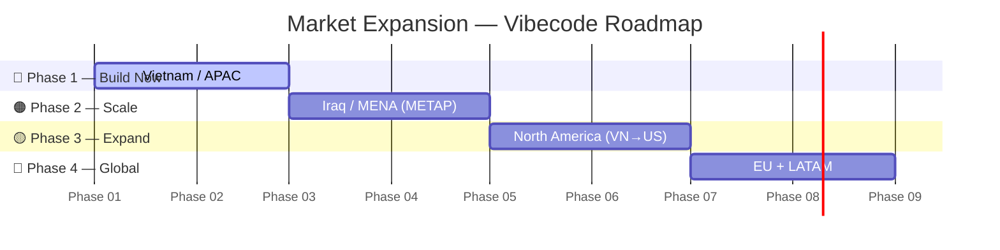
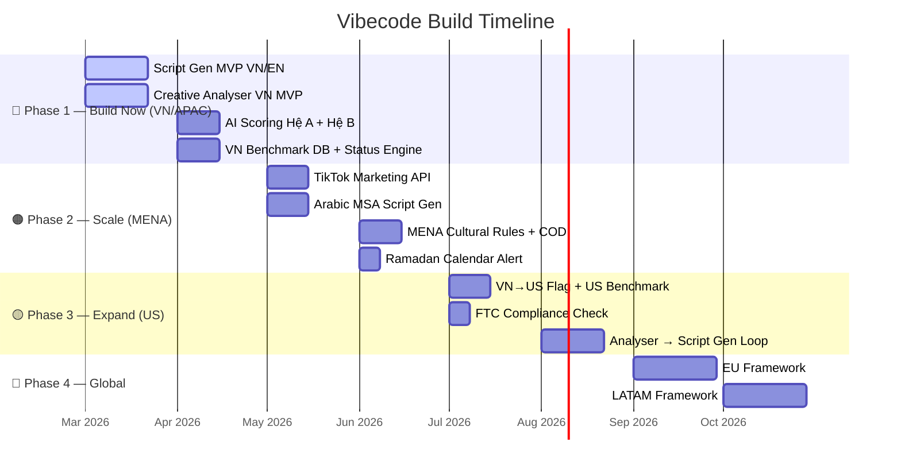
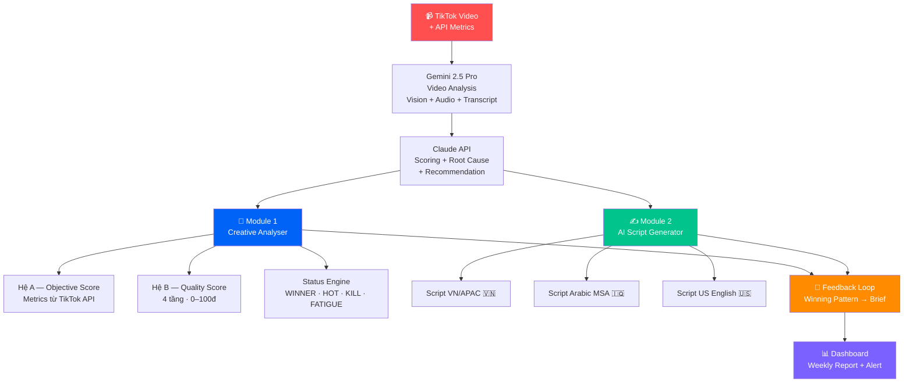
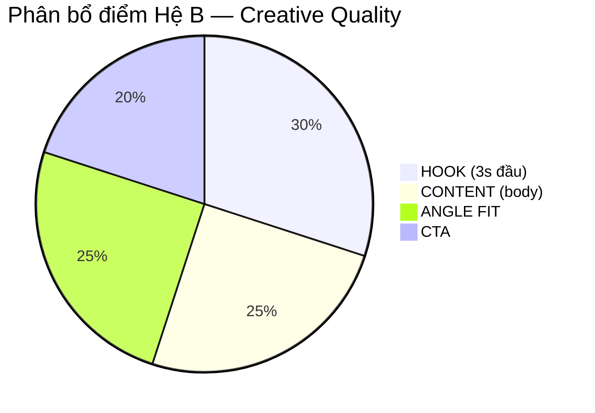
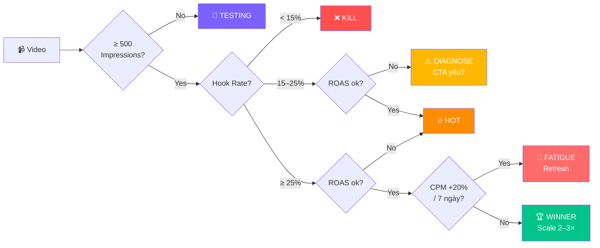

# 🏆 Product Roadmap — Creative Scoring Platform (TikTok Ads Agency)

> **Mục tiêu sản phẩm**: Không chỉ tìm ra video thắng — mà tìm ra **công thức nhân bản video thắng**.  
> **Khách hàng mục tiêu**: Agency quản lý TikTok Ads — Pain points: Report, Scale, Automation.  
> **Approach**: Vibecoding — Build fast & iterate. Phase 1 + 2 gộp lại, code ngay.

---

## 📌 Executive Summary

| Hạng mục | Chi tiết |
|---|---|
| **Sản phẩm** | Creative Scoring & AI Script Generation Platform cho TikTok Ads Agency |
| **Approach** | 🚀 Vibecoding — không validate manually, code trực tiếp & iterate nhanh |
| **Phase 1** (Build Now) | 🇻🇳 Vietnam / APAC + ✍️ Script Gen + 🎬 Analyser MVP gộp lại |
| **Phase 2** (Scale) | 🇮🇶 Iraq / MENA + TikTok API automation |
| **Phase 3** (Expand) | 🇺🇸 North America + Full feedback loop |
| **Phase 4** (Global) | 🇪🇺 EU + 🌎 LATAM |
| **Tech stack** | Gemini 2.5 Pro + Claude AI + TikTok API + Supabase |
| **Competitive edge** | Phân tích từng element của video — chỉ rõ sửa ở đâu, không chỉ chấm điểm tổng |

---

## 🌍 Thị Trường Mục Tiêu — Theo Từng Phase

| Phase | Khu vực | Quốc gia cụ thể | Trạng thái |
|:---:|---|---|:---:|
| 🔴 **Phase 1** | 🇻🇳 **Vietnam / APAC** | 🇻🇳 Việt Nam, 🇹🇭 Thái Lan, 🇮🇩 Indonesia, 🇵🇭 Philippines, 🇲🇾 Malaysia, 🇸🇬 Singapore, 🇦🇺 Úc, 🇳🇿 New Zealand | ✅ Code ngay |
| 🟠 **Phase 2** | 🇮🇶 **Iraq / MENA (METAP)** | 🇮🇶 Iraq, 🇦🇪 UAE, 🇸🇦 Saudi Arabia, 🇪🇬 Ai Cập, 🇵🇰 Pakistan, 🇹🇷 Thổ Nhĩ Kỳ, 🇲🇦 Morocco, 🇩🇿 Algeria | 🟠 Phase 2 |
| 🟡 **Phase 3** | 🇺🇸 **North America** | 🇺🇸 Hoa Kỳ (VN Sellers → US TikTok Shop), 🇨🇦 Canada | 🟡 Phase 3 |
| 🔵 **Phase 4** | 🇪🇺 **EU + LATAM** | 🇩🇪 Đức, 🇫🇷 Pháp, 🇮🇹 Ý, 🇪🇸 Tây Ban Nha, 🇧🇷 Brazil, 🇲🇽 Mexico, 🇨🇴 Colombia, 🇦🇷 Argentina | 🔵 Phase 4 |

---

## 💡 Pain Points & Recommendations — Tại Sao Cần Sản Phẩm Này?

### 🇻🇳 Vietnam / APAC — Pain Points

| Pain Point | Biểu hiện thực tế | Giải pháp của Platform |
|---|---|---|
| Không biết creative nào đang waste budget | Chạy 5 creative, chỉ nhìn CPA tổng | AI chấm điểm từng creative, chỉ rõ điểm yếu |
| Mất 3–4h/tuần làm báo cáo tay | Copy số từ Ads Manager vào Excel | Dashboard tự động + narrative AI giải thích |
| Không giải thích được tại sao creative thua | Chỉ nói "do thuật toán" với client | Root Cause Analysis 5 bước kèm số liệu cụ thể |
| Creative fatigue không phát hiện sớm | ROAS giảm dần sau 7–10 ngày, không có alert | Auto-alert khi CPM tăng >20% / 7 ngày |
| Không có benchmark để so sánh | Không biết CTR 1.2% là tốt hay tệ | Benchmark DB theo ngành × objective × market |
| Angle bị lặp lại, bão hòa | Cứ dùng angle giá rẻ dù đã mất hiệu quả | Winning Pattern Discovery → gợi ý angle mới |

### 🇮🇶 Iraq / MENA — Pain Points

| Pain Point | Biểu hiện thực tế | Giải pháp của Platform |
|---|---|---|
| Creative global không convert local | Copy creative US/EU về MENA → CTR thấp, CPA cao 2–3× | Gemini detect "Western style" → flag + gợi ý điều chỉnh |
| Ngôn ngữ không phù hợp MENA | English hoặc Arabic dịch thô → audience không relate | Script gen bằng Arabic MSA chuẩn — không dịch |
| CTA sai cho COD market | Dùng "Buy Now" thay vì "Order – Pay on Delivery" | Auto-detect CTA pattern → flag sai format |
| Bỏ qua Ramadan — mùa cao điểm | Không có creative Ramadan → thua competitor 40–60% CTR | Alert 30 ngày trước Ramadan + Eid |
| Không có MENA benchmark | Dùng nhầm benchmark VN cho Iraq | Benchmark MENA riêng biệt — không mix với VN |

### 🇺🇸 VN → US — Pain Points

| Pain Point | Biểu hiện thực tế | Giải pháp của Platform |
|---|---|---|
| Creative VN không convert US | Hook quá nhanh, quá "salesy" — US cần trust trước | Flag "VN-style pattern" + suggest US tone |
| Accent & language barrier | Voice-over nặng accent → drop-off cao trong 3s đầu | Gemini detect accent → suggest AI voice-over |
| Không hiểu FTC compliance | Claim sản phẩm không đúng chuẩn Mỹ → account risk | Scan claim mạnh → flag CRITICAL + hướng dẫn sửa |

---

## 🗺️ Vibecode Roadmap — 4 Phase (Build Fast)

> ⚡ **Vibecoding approach**: Phase 1 + Phase 2 cũ gộp thành **Phase 1 duy nhất** — code Script Gen & Analyser song song, không wait.

### Chi Tiết Từng Phase

| Phase | Thị trường | Deliverables chính | Ghi chú |
|:---:|---|---|---|
| 🔴 **Phase 1** | 🇻🇳 VN / APAC | ① Script Gen VN/EN (3 variations/objective, < 30s) ② Analyser: Hệ A (metrics API) + Hệ B (4 tầng 0–100đ) ③ Status Engine (WINNER/KILL/FATIGUE) ④ VN Benchmark Database ⑤ Dashboard + Weekly Report | **Code ngay, gộp Script Gen & Analyser** — không tách phase |
| 🟠 **Phase 2** | 🇮🇶 Iraq / MENA | ① TikTok Marketing API auto-pull ② Arabic MSA Script Gen (Claude) ③ MENA Cultural Rules (Gemini review) ④ COD CPA/AOV auto-detect ⑤ Ramadan Calendar Alert | Mở sau Phase 1 stable |
| 🟡 **Phase 3** | 🇺🇸 North America | ① VN→US module (style detection) ② FTC compliance scanner ③ US benchmark (by category) ④ Analyser → Script Gen closed loop ⑤ Winning Pattern Brief Generator | Full feedback loop |
| 🔵 **Phase 4** | 🇪🇺 EU + 🌎 LATAM | ① GDPR compliance layer ② Multi-language EU (DE/FR/IT/ES) ③ Spanish/Portuguese NLP (LATAM) ④ COD market LATAM (Mexico, Colombia) | Mở sau APAC + NA ổn định |

---

## 🧩 Kiến Trúc Sản Phẩm — 2 Module Core

---

## ⚖️ Hệ Thống Chấm Điểm — Scoring Engine

### Hệ A — Objective-Based Score (Metrics từ API)

| Objective | Trọng số chính | Note |
|---|---|---|
| **Web EC (Online Payment)** | ROAS 40% · Hook 25% · CTR 25% · Retention 10% | Pixel CompletePayment |
| **Web EC (COD — MENA/LATAM)** | CPA/AOV 40% · Hook 25% · CTR 25% · Retention 10% | Auto-switch khi ROAS = null |
| **TikTok Shop** | ROAS GMV 35% · Hook 25% · Product CTR 25% · Retention 15% | In-app conversion |
| **Lead Generation** | CPA 40% · Hook 30% · CTR 20% · Retention 10% | Cost per lead |
| **Web Non-EC** | CPA 35% · Hook 25% · CTR 25% · Retention 15% | SaaS, App, Blog |
| **Awareness** | Hook 40% · 6s View 30% · Retention 20% · CTR 10% | Top of Funnel |

> ⚙️ **COD Auto-Detect**: Tự nhận diện `IQ, PK, EG, SA, CO, PE, MA...` là COD market → switch sang CPA/AOV, không cần cấu hình tay.

### Hệ B — Creative Quality Score (0–100 điểm)

| Tầng | Điểm | Tiêu chí | Action khi thấp |
|---|:---:|---|---|
| 🎣 **HOOK** | 30đ | Hook Speed · Hook Type · Hook–Audience Match | < 15đ → đổi toàn bộ 3s đầu, giữ body |
| 📽️ **CONTENT** | 25đ | Problem–Solution Flow · Social Proof · Native Feel | Thiếu proof → thêm số liệu cụ thể |
| 📣 **CTA** | 20đ | CTA Clarity · CTA–Objective Match | Sai objective → đổi ngay |
| 🎯 **ANGLE FIT** | 25đ | Nhất quán 1 angle · Angle–Objective Fit | Loãng → chọn 1 angle duy nhất |

| Score | Đánh giá | Hành động |
|:---:|:---:|---|
| 85–100 | 🟢 Top Creative | Scale ngay, tăng budget |
| 70–84 | 🟡 Tiềm năng | Iterate đúng 1 điểm yếu |
| 50–69 | 🟠 Trung bình | Chờ 3–5 ngày, không scale |
| 30–49 | 🔴 Yếu | Dừng hoặc rework |
| 0–29 | ⛔ Tệ | Tắt ngay, phân tích nguyên nhân |

---

## 🚦 Status Engine — Phân Loại Video Tự Động

---

## 📊 Benchmarks — Theo Thị Trường

### 🇻🇳 Vietnam / APAC *(Phase 1)*

| Metric | ⛔ Kém | 🟠 TB | 🟡 Tốt | 🟢 Xuất sắc |
|---|:---:|:---:|:---:|:---:|
| Hook Rate (3s) | < 15% | 15–25% | 25–35% | > 35% |
| 6s View Rate | < 10% | 10–20% | 20–35% | > 35% |
| Retention | < 20% | 20–30% | 30–50% | > 50% |
| CTR – Web EC | < 0.8% | 0.8–1.5% | 1.5–2.5% | > 2.5% |
| CTR – Lead Gen | < 1.2% | 1.2–2% | 2–3% | > 3% |
| ROAS | < 1× | 1–2× | 2–3× | > 3× |

### 🇮🇶 Iraq / MENA — COD Market *(Phase 2)*

| Metric | ⛔ Kém | 🟠 TB | 🟡 Tốt | 🟢 Xuất sắc |
|---|:---:|:---:|:---:|:---:|
| Hook Rate (3s) | < 12% | 12–20% | 20–30% | > 30% |
| CTR – Web EC | < 0.5% | 0.5–1.2% | 1.2–2% | > 2% |
| CPA / AOV ratio | > 30% | 20–30% | 10–20% | < 10% |

> ⚠️ Không dùng chung benchmark VN cho MENA. ROAS thay bằng CPA/AOV (COD market).

### 🇺🇸 VN Sellers → TikTok Shop US *(Phase 3)*

| Metric | ⛔ Kém | 🟠 TB | 🟡 Tốt | 🟢 Xuất sắc |
|---|:---:|:---:|:---:|:---:|
| Hook Rate (3s) | < 15% | 15–25% | 25–35% | > 35% |
| CTR – TikTok Shop US | < 0.7% | 0.7–1.2% | 1.2–2% | > 2% |
| VTR (Completion) | < 15% | 15–25% | 25–40% | > 40% |
| ROAS | < 1.5× | 1.5–2.5× | 2.5–4× | > 4× |

---

## 🛠️ Tech Stack

| Layer | Lựa chọn | Lý do |
|---|---|---|
| **Video AI** | Gemini 2.5 Pro | Vision + Audio + Transcript trong 1 call, không cần FFmpeg |
| **Scoring & Reasoning** | Claude (Anthropic) | Structured reasoning, tiếng Việt & Arabic MSA tốt nhất |
| **US Script** | OpenAI GPT-4o | Chuyên biệt US English tone |
| **Database Phase 1–2** | Supabase PostgreSQL | Managed DB, dễ dùng, đủ cho < 50K creatives |
| **Database Phase 3+** | Supabase + ClickHouse | Analytical queries lớn, không vendor lock-in |
| **Queue** | BullMQ + Redis | Tránh mất TikTok preview URL (TTL ~1–6h) |
| **Backend** | Node 22 + Express.js | Nhẹ, ecosystem lớn |
| **Frontend** | Vue 3 + Vite + Tailwind | Build nhanh, reactive |
| **Deploy** | AWS Singapore (ap-southeast-1) | Latency tốt cho APAC & MENA |

---

## ✅ KPI — Success Metrics Theo Phase

| Phase | Thị trường | KPI Target |
|:---:|---|---|
| 🔴 **Phase 1** | VN / APAC | ≥ 3 agency dùng thường xuyên · NPS > 40 · Agency tiết kiệm ≥ 3h/tuần |
| 🟠 **Phase 2** | Iraq / MENA | ≥ 3 agency MENA onboard · Churn < 10% · Arabic script được dùng thực tế |
| 🟡 **Phase 3** | North America | ≥ 5 VN seller chạy US TikTok Shop · FTC flag accuracy > 90% |
| 🔵 **Phase 4** | EU + LATAM | ≥ 2 agency EU · ≥ 2 agency LATAM · GDPR compliance passed |

---

*📅 Cập nhật: 2026-03-13 | Vibecode approach — Phase 1+2 gộp, build fast & iterate*
